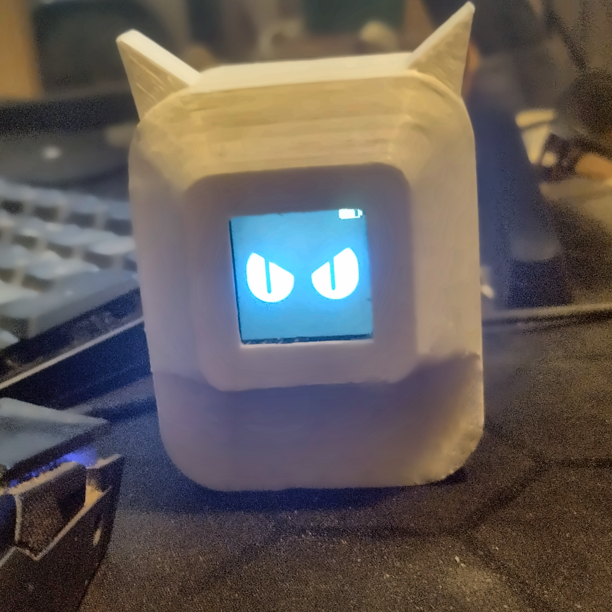
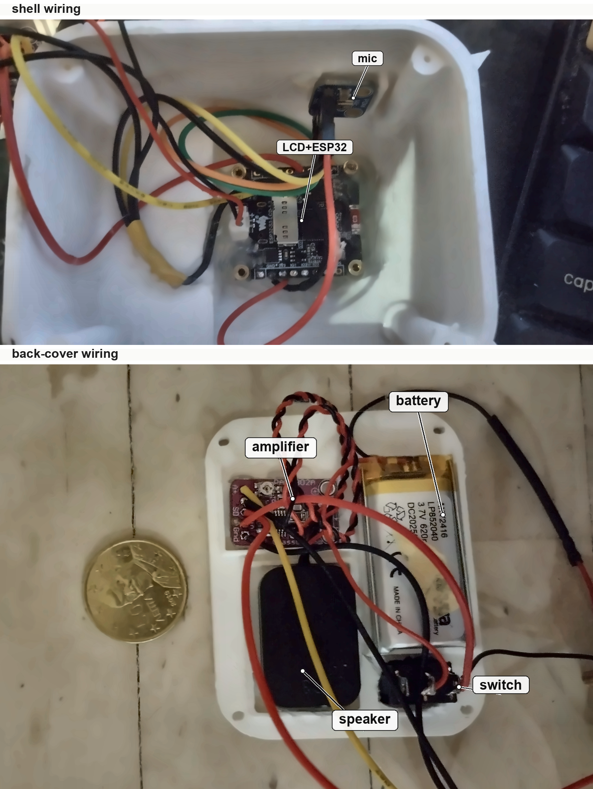
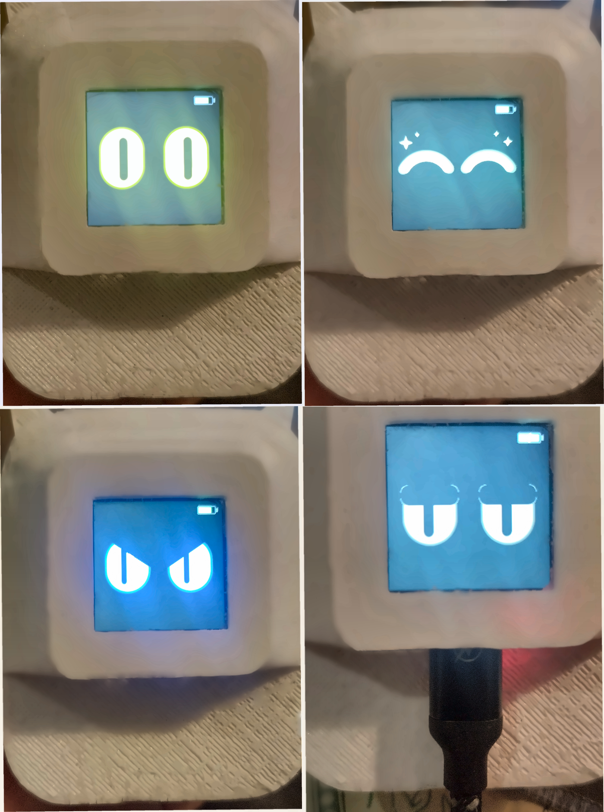

# Tinypurr

**A battery-powered TinyML deskbot**

<p align="left">
  
</p>

### [▶️ Click to watch the demo](https://youtu.be/R_blxCwtges)

It sits with bored eyes and listens. When it hears **yes**, **no** or **happy**
it shows the matching expression, plays a matching sound for five seconds, and
then goes back to bored. The screen also shows the battery percentage and charging when USB is in, so it runs as a standalone device.

Speech recognition and all reaction sounds run on the device. The growl, meowing
and purr are custom synthesized in firmware rather than played from recorded
clips. A small neural network takes 127 ms to decide which word it heard.

## Motivation

TinyML has been the focus of my PhD research for the last 3 years but never created any hobby product outside research. I also have seen a lot of small deskbots that I love, but many of them depend on external
processing and/or power(USB). I wanted to make something closer to a real standalone thing which would be battery powered and able to react without
streaming anywhere.

This is also a spare-parts prototype, not a claim that these are the optimal parts. I had a couple of suitable modules already, a CR-10 3D printer that had been sitting for 3-4 years. The screen was basically the one part bought for
the build, the rest of the hardware was chosen because I had it in the shelf.

## Build

```
pio run -d firmware -e waveshare_s3_lcd13 -t upload
```

Built with **ESP-IDF 4.4.7**, through PlatformIO. The Arduino core is compiled
in as an ESP-IDF component since the display
library needs it. PlatformIO installs the toolchain and both frameworks on the
first build.

Libraries:

| library | what it does |
|---------|--------------|
| TFT_eSPI | the 240x240 ST7789 display, fetched on build |
| Edge Impulse model | the keyword model and its MFCC front end, in the repo under `firmware/lib` |

Everything else is native. The microphone and the speaker are both PDM on I2S0
through `driver/i2s.h`. From
the Arduino core itself the firmware uses `Serial`, `millis`,
`pinMode`/`digitalWrite`, and `analogReadMilliVolts` for the battery.

The whole firmware is in `firmware/src`, `main.cpp` for the reactions,
`mic.cpp` for capture, `audio.cpp` for the sounds, `battery.cpp` for the battery gauge,
`ei_alloc.cpp` to align the model's buffers and place them in PSRAM.

## Dataset

The dataset is built with `dataset/build_gsc_dataset.py` from Google Speech
Commands. It creates the three keyword classes, `yes`, `no`, and `happy`, plus a
`background` class made from the other wordsand its noise
recordings.

The script writes an Edge Impulse upload-ready `gsc_set/` folder. More detail is
in `dataset/README.md`.

## The model

Trained in Edge Impulse. MFCC features into a small 1D convolutional network,
four classes: `yes`, `no`, `happy`, `background`.

```
MFCC            13 coefficients -> 650 features (13 x 50 frames)
reshape         13 columns
conv1d + pool    64 filters, kernel 3, 2 layers      dropout 0.25
conv1d + pool   128 filters, kernel 3, 2 layers      dropout 0.25
conv1d + pool   256 filters, kernel 3, 2 layers      dropout 0.30
flatten -> dense 128 -> 4 classes
```

About 95% accuracy on a held-out test set, and on the device **127 ms per word**
latency. 450 KB of flash for the weights, and about 175 KB of PSRAM while it
runs  a 100 KB persistent buffer. Internal RAM has the free space but
cannot hand out a 100 KB contiguous block once the audio buffers are placed.

Two findings from getting there:

**A custom MFCC network beats MFE transfer learning.** A MobileNet-based transfer
learning block (MFE-based) reached similar accuracy but was 5 to 30 times slower on this
chip. A network sized for the problem with MFCC, trained from scratch on the same data, was better.

**esp-nn is worth a lot** Espressif's optimised
kernels use the S3's vector instructions and are the difference between 927 ms
and 86 ms of network time on the same model, roughly eleven times. 

## Deciding what it heard

Each word is classified three times inside the same one-second window because the exact start of a word is never known. The three votes
are averaged, weighted by how decisive each was, and the cat reacts only if the
winner scores at least **0.70** and sits **0.35** clear of the runner-up.Three inferences cost about 380 ms, on its own core,
so the eyes keep moving.

## Tuning

Two things that are constants in the firmware, you can change them and reflash.

**Volume**, `firmware/src/audio.cpp`. Range 0.0 to 1.0.

```c
static volatile float gVolume = 0.15f;
```

**Microphone sensitivity**, `firmware/src/mic.cpp`. Clamped to 1-400.

```c
static volatile float gGain = 100.0f;
```

If it starts answering when you did not speak to it, the two reject gates in
`firmware/src/main.cpp`. Raise either to make it
harder.

```c
static const float MIN_CONFIDENCE = 0.70f;
static const float MIN_MARGIN     = 0.35f;
```

## Parts

 These are the parts that were to hand, and the
alternatives are what matters if you are building your own.  The Waveshare ESP32-S3-LCD-1.3 is a
development board with the ESP32-S3, 1.3 inch 240x240 ST7789 LCD, QMI8658 IMU, USB-C bridge, and LiPo charger already
on the board.

| part | used here | alternatives |
|------|-----------|--------------|
| board | [Waveshare ESP32-S3-LCD-1.3](https://www.waveshare.com/product/esp32-s3-lcd-1.3.htm), 240×240 ST7789 | any ESP32-S3 with an SPI LCD; pins live in `firmware/platformio.ini` |
| microphone | [Adafruit PDM MEMS breakout](https://www.adafruit.com/product/3492) | this particular microphone has worked well for me with very clear sound. I2S microphones can also work |
| amplifier | PAM8302 mono class-D | worked for the prototype, but it is not what I would pick from scratch. Since the ESP32-S3 has no DAC, a digital amplifier such as an I2S amp would probably be easier |
| speaker | 4–8 Ω, ~2 W, 20 × 30 × 6.8 mm | anything in that range |
| battery | LiPo, 3.7 V, 620 mAh, 40 × 25 × 6 mm, Molex 1.25 mm | any single-cell LiPo |
| switch | KCD5-102 rocker | any matching switch |

## Wiring

The LCD pins below are the board's built-in Waveshare routing used by
TFT_eSPI.

Battery charging is also handled by the board, the firmware only reads the
cell voltage from IO6.

| Part | Pin |
|------|-----|
| LCD | DC GPIO38, CS GPIO39, SCLK GPIO40, MOSI GPIO41, RST GPIO42, backlight GPIO20 |
| microphone | CLK GPIO7, DATA GPIO8, SEL to GND |
| amplifier | A+ GPIO12, SD GPIO10, A- to GND, VIN to battery + |
| battery sense | GPIO6 |

Two things are easy to get wrong:

**Ground the amplifier's unused input.** On the PAM8302 that is A-.

**Power the amplifier from the battery**, not from 5V and not from 3V3. The 5V
pin is USB-only on this board, so on battery the amp has no supply. 3V3 is too weak for the amplifier and can add noise to the microphone.

<p align="left">
  
</p>

## Enclosure

The 3D-printed enclosure is still being edited. For the current prototype, parts are held in place with hot
glue, while the Adafruit PDM microphone breakout is mounted with double-sided tape since glue can damage it. The STL files are kept local for now.

## Expressions

<p align="left">
  
</p>

## To-do

- finalize 3D print design and upload STL files
- take advantage native ESP32 networking
- utilize the free IMU
- make a custom PCB

## License

This project is licensed under the Creative Commons
Attribution-NonCommercial-ShareAlike 4.0 International
([CC BY-NC-SA 4.0](LICENSE)). This covers the trained model as well as the
firmware, the enclosure and the documentation.

Commercial use of this project or any derivative works is not permitted without
explicit permission from the author.

The Edge Impulse SDK under `firmware/lib` keeps its own terms: BSD 3-Clause
Clear. Google Speech Commands, which the model is trained on, is CC BY 4.0.

